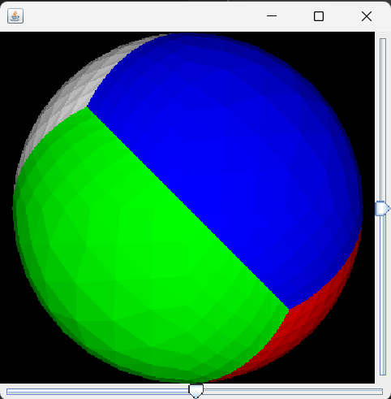

# Java 3D Rendering Engine (from Scratch)
A minimal 3D rendering engine built entirely in Java, without relying on OpenGL or external graphics libraries.
This project demonstates orthographic projection, wireframe rendering, and custom rendering logic using only Java's standard libraries(Swing,AWT,Graphics2D).

This project is built directly on top of Java’s AWT/Swing framework, meaning every line of rendering logic — from projection to triangle drawing — is written manually. It serves both as a learning resource and a minimalist engine that shows how 3D rendering works under the hood.
---
##Features
* Pure Java Implementation - no external libraries, only AWT and Swing;
* Custom rendering pipline:
    - Orthographic projection
    - Rotation controls for X and Y axis
    - Wireframe rendering of 3D models
* Interactive UI with sliders to control rotation (Using `Jslider`).
* Object-Oriented design : modular `Triangle` and `Vector` classes for easy extension.
---
##Tech Stack 
*  Language: Java(JDK 8+)
*  Libraries Used:
     - `java.awt`/`javax.swing` --> for rendering and UI
     - `java.awt.geom` --> for drawing vector paths
     - `java.util` --> collections(`List`,`ArrayList`)
---
##Demo

---
##How it works
- Vertices & Triangles – 3D points (`Vector`) are grouped into triangles (`Triangle`).
- Projection – Z-coordinate is ignored for orthographic projection, mapping 3D points into 2D space.
- Rendering – Triangles are drawn using `Graphics2D` and `Path2D`.
- User Controls – Sliders rotate the model in real time (horizontal & vertical).

---

##Getting Started
<b>Prerequisites</b>
* Install Java JDK 8+
* Clone the repository
`git clone https://github.com/TypicalW/3D-Render-Engine.git
cd 3D-Render-Engine`
<b>Run</b>
`javac Render_3D/*.java
java Render_3D.Viewer`

---
##Why This Project is Special
* Shows low-level graphics programming concepts usually hidden by modern game engines.
* Great for <b>learing 3D math (matrices, vectors, projection).</b>
* Written in vanilla Java, making it portable and easy to run anywhere
---
##Credits
* Inspired by [Rogach's blog on 3D rendering in Java(2015)](http://blog.rogach.org/2015/08/how-to-create-your-own-simple-3d-render.html)

  

